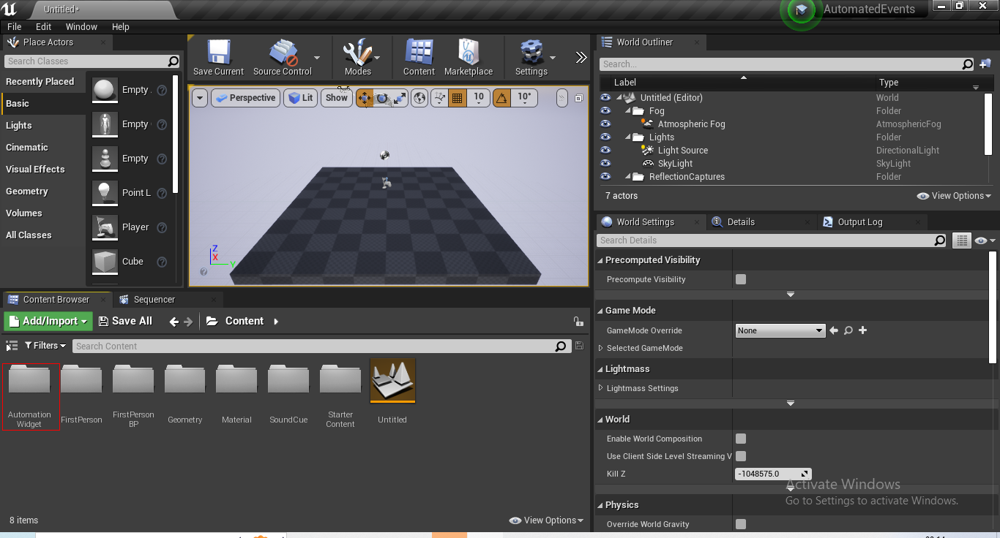
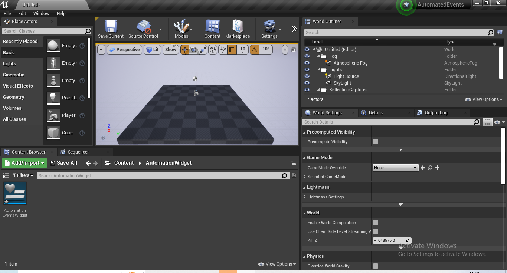
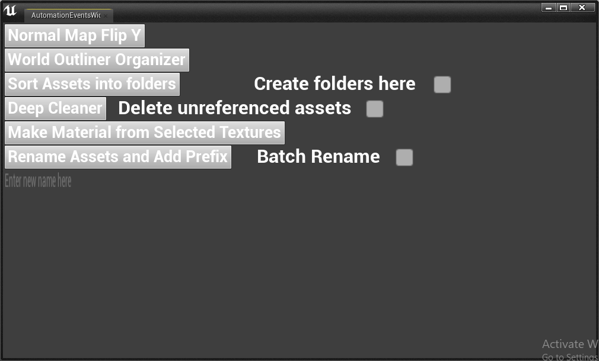

 

<h3 align="center">CODE SAMPLES</h3>

  

    SURYAPRAKASH HALWASIA
     
    <strong>This is for the University of Utah-Technical Art Track</strong>
     
    

<!-- UNREAL AUTOMATION USING PYTHON -->
## Unreal Automation using Python

 
<h4>These scripts automate certain events in Unreal using Python. Utilizing the Python plugin inside Unreal the following events are automated:
</h4>

<ol>
<li><h4>Blueprint from Asset: This script creates a blueprint from the selected asset (static mesh or particle system). This script only works on UE5+</h4> </li>
<li><h4>Cleaner: This script allows the user to remove unreferenced assets from the project and removes all empty folders in the project. Works on UE4.26+.</h4> </li>
<li><h4>Folder Creator for Assets: This script sorts all selected assets into folders named on their type (i.e. Static Mesh, Materials, etc).  Works on UE4.26+.</h4> </li>
<li><h4>Material from Selected Textures: This script creates a material from the selected diffuse, normal and mask map.  Works on UE4.26+.</h4> </li>
<li><h4>Normal Map Flip Y Channel: This script flips the normal map's y channel.  Works on UE4.26+.</h4> </li>
<li><h4>Asset Prefixer and Renamer: This script provides the user with the option to add a prefix to the asset based on its type. Additionally, the user can also mass rename the selected assets. Works on UE4.26+.</h4> </li>
<li><h4>World Outline Organizer: This script organizes all assets in the level into folders. Works on UE4.26+.</h4> </li>
</ol>

### Automation Blueprint Widget
Additionally, the Unreal Project with the blueprint widget to access the scripts is present as a repository. The 
project is version UE 4.26. The blueprint from asset script is not provided in this unreal project as it works
only on version UE5.0+.
  
  

  
  

  
  

 
